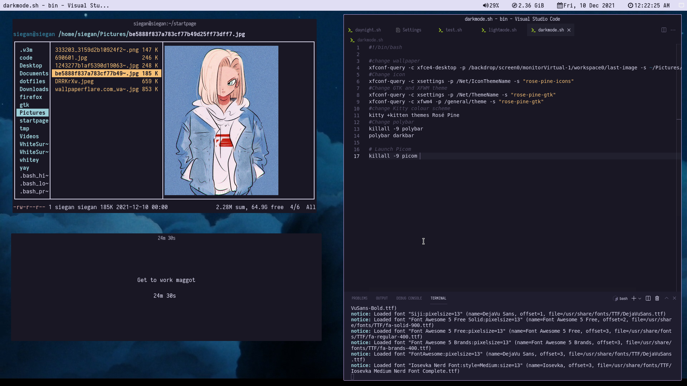
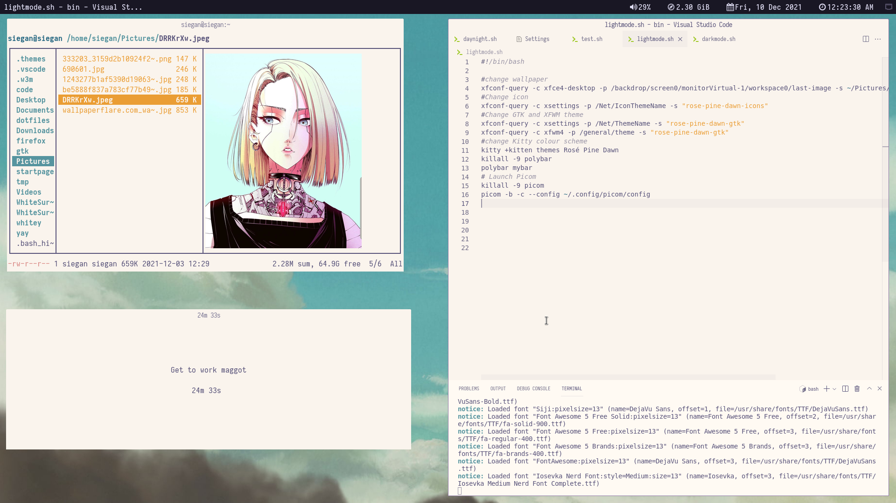

# Mah Dotfiles

Nothing special. Just a mix between something minimal and usable for my daily driver.

## Stuff

* Panel -> Polybar
* WM -> XFCEWM
* Compositor -> Picom
* GTK/XFWM THeme -> Rosé Pine (Dawn)
* Colour Scheme -> "
* Terminal -> Kitty

## Pics

## Dark Mode

## Light Mode

